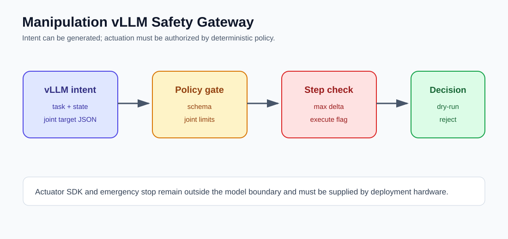
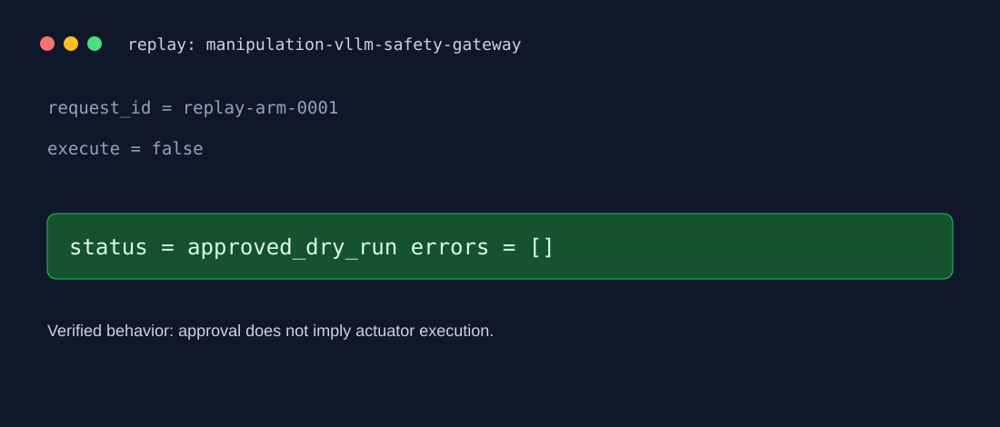

# Manipulation vLLM Safety Gateway





A robot-arm planning gateway that turns a model proposal into either a validated joint target or a hard rejection. The model is allowed to express intent; it is never trusted with actuator limits.

## Run with a real or replayed plan

```powershell
$env:PYTHONPATH = "src"
python -m arm_gateway.cli data\arm_request.json
```

To use vLLM, provide `VLLM_MODEL` and point `VLLM_BASE_URL` at an OpenAI-compatible server. Without it, the gateway returns `planner_unavailable` rather than inventing a motion plan.

## Safety layers

1. Validate the request schema.
2. Validate every joint against the configured limits.
3. Enforce maximum joint-space step from the measured state.
4. Require an explicit `execute` flag before an actuator adapter can be called.

The default CLI is dry-run and emits a JSON decision. A real robot adapter should be added behind `execute`, with a vendor SDK, controller watchdog, and an independent hardware emergency stop.

## NVIDIA / simulation paths

- `arm_gateway.trajectory` creates bounded joint-space waypoints after the safety decision.
- `arm_gateway.isaac_export` writes a simulator-neutral JSON trajectory that an Isaac Sim/Omniverse adapter can consume; it does not claim to be a USD asset or a physics result.
- A production stack can validate the same target in Isaac Sim, export calibrated collision geometry, then connect a vendor controller only after simulation and hardware checks pass.

Official reference: [NVIDIA Isaac robotics platform](https://developer.nvidia.com/isaac/).
